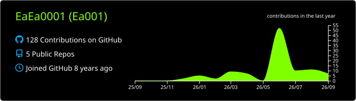
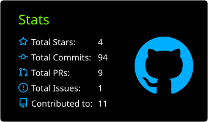
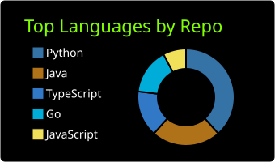

<div align="center">

<a href="https://git.io/typing-svg"></a>

</div>

```console
┌──(root㉿EaEa0001)-[~]
└─# whoami

Ea001 — Independent Security Researcher
Focus: Web/AppSec · Vulnerability Discovery & Responsible Disclosure
       AI/LLM Application Security (Agents, RAG, MCP)
       Security Tooling & Automation

┌──(root㉿EaEa0001)-[~]
└─# ls -1 ~/disclosures | wc -l
11
```

---

### `~/disclosures` — CVE & Advisory Tracker

| # | Target | Vulnerability | Reference | Notes |
|---|--------|---------------|-----------|-------|
| 1 | Dify | SSRF | [CVE-2026-28504](https://www.cve.org/CVERecord?id=CVE-2026-28504) | Server-side request forgery |
| 2 | SiYuan Note | Sensitive-path read bypass | [CVE-2026-25992](https://www.cve.org/CVERecord?id=CVE-2026-25992) | Case-insensitive filesystem bypass of path interception |
| 3 | Remotion | RCE (Windows) | [CVE-2026-30120](https://www.cve.org/CVERecord?id=CVE-2026-30120) | Direct remote code execution |
| 4 | Remotion | Arbitrary file write | [CVE-2026-30121](https://www.cve.org/CVERecord?id=CVE-2026-30121) | Via file upload |
| 5 | Flowise | Broken access control |[CVE-2026-70471](https://www.cve.org/CVERecord?id=CVE-2026-70471) | Privilege escalation, potential RCE |
| 6 | Windows Notepad | RCE | [CVE-2026-20841](https://www.cve.org/CVERecord?id=CVE-2026-20841) | Assisted in follow-up bypass discovery |
| 7 | OpenClaw | Broken access control | [CVE-2026-41298](https://www.cve.org/CVERecord?id=CVE-2026-41298) | — |
| 8 | RAGFlow | RCE | [CVE-2026-35513](https://www.cve.org/CVERecord?id=CVE-2026-35513) | Remote code execution |
| 9 | Zammad | Minor security issue | [CVE-2026-34720](https://www.cve.org/CVERecord?id=CVE-2026-34720) | Low-impact finding |
| 10 | Cloudreve | OAuth2 bypass | [CVE-2026-54560](https://www.cve.org/CVERecord?id=CVE-2026-54560) | OAuth2 flow bypass |
| 11 | Spring AI | DoS | CVE-2026-59339 | |
| 12 | MaxKB | sandbox escape |[CVE-2026-79919](https://github.com/1Panel-dev/MaxKB/security/advisories/GHSA-6h35-c779-4v37)|  sandbox escape
| 13 | Apache Camel | Template Injection | CVE-2026-78164
 

---

### `~/arsenal`


---

### `~/stats`

<div align="center">







</div>

---

```console
┌──(root㉿EaEa0001)-[~]
└─# echo $MOTTO
"Hack the planet — responsibly."
```

<div align="center">


</div>
